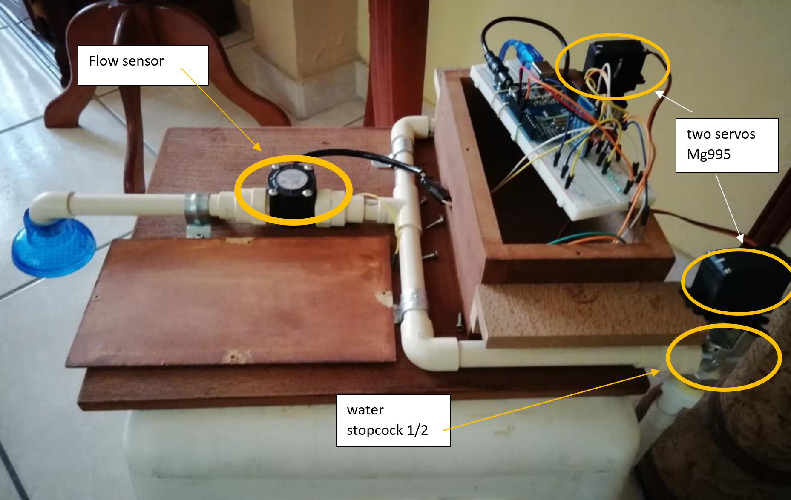
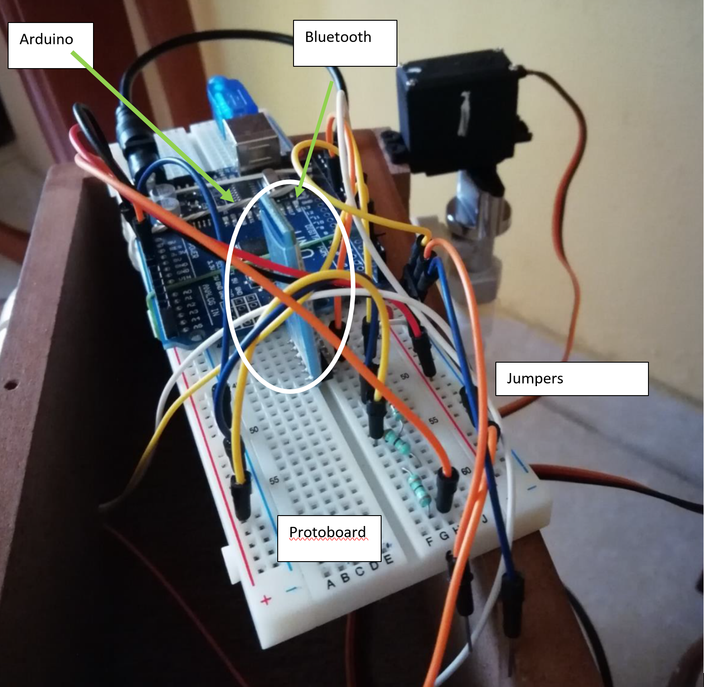
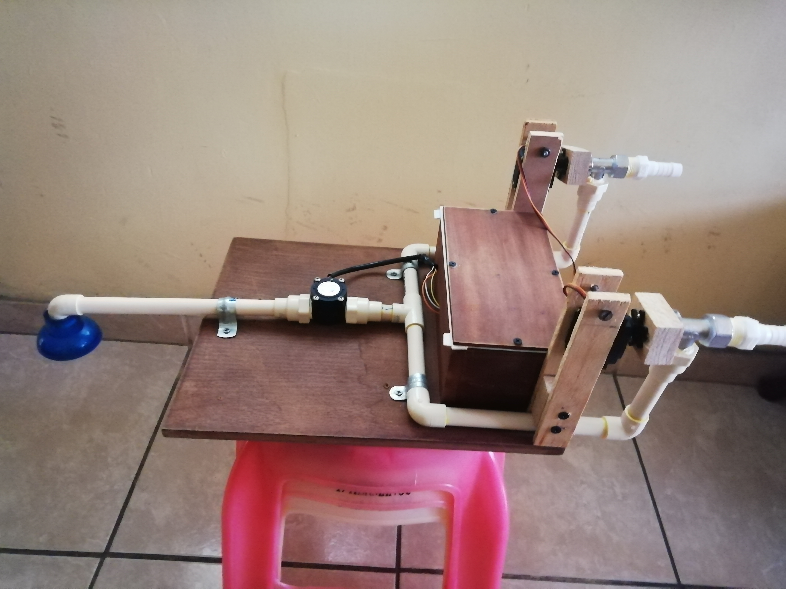
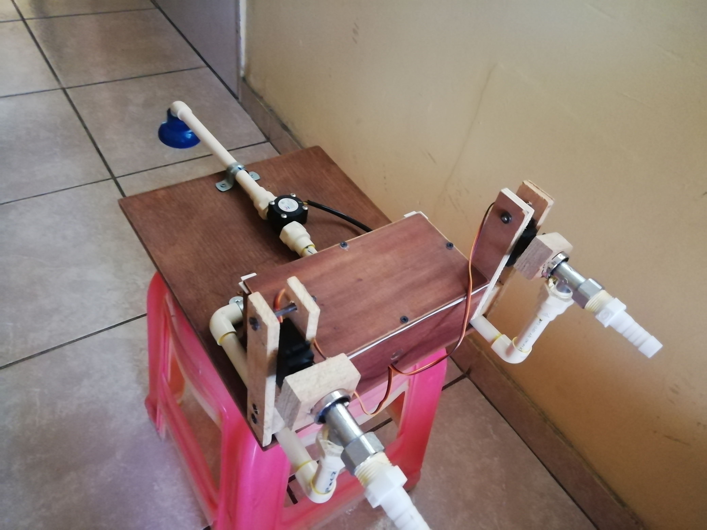
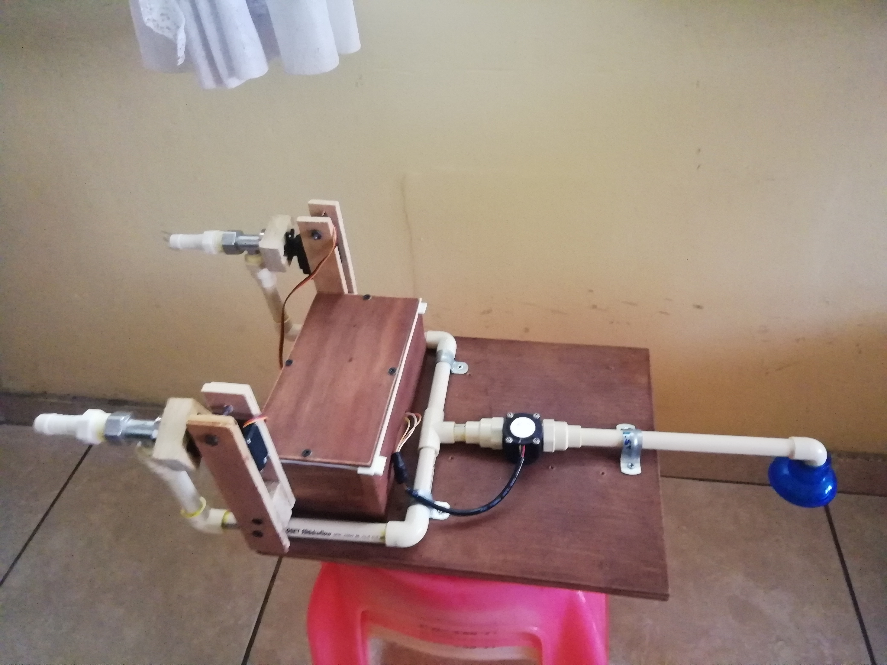
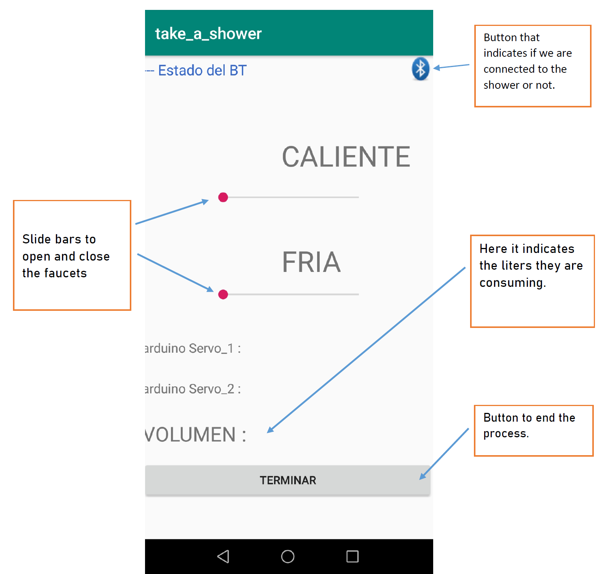

# Smart Shower  
### This is a prototype of a bathroom shower controlled with Arduino by an Android  app via Bluetooth.  
Video:  
https://twitter.com/Gabrich888/status/1263531427418775552

The user manual is the "user_manual.pdf" file.  
This repository contains the java and xml files, and also contains the arduino file.

Here are some images of the prototype:   

 

 

 

 

 

